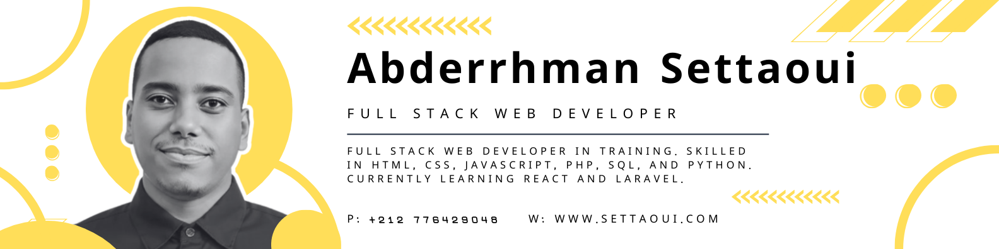

# Hello, I'm Abderrhman Settaoui

  

  
  
  

---

## About Me

  

---

  

  I am a passionate <strong>full-stack developer</strong>, currently studying <strong>Digital Development</strong> at OFPPT (2024–2026). I specialize in building modern, efficient, and well-structured web applications by following best development practices.

---

## Technologies & Tools

### Frontend

  
  
  
  
  
  

### Backend

  
  
  
  
  

### Tools & Platforms

  
  
  
  

---

## GitHub Statistics

  
  

  
  

---

## Featured Projects

  

---

## Education & Languages

### Education

| Year                          | Degree                                                       | Institution                             |
|------------------------------|---------------------------------------------------------------|------------------------------------------|
|  |  |  |
|  |  |  |

---

### Languages

  
  

---

## Collaboration

  

I'm always open to collaborations and new projects! If you have a cool idea or you're looking for someone to:

- Build a web application  
- Create a modern showcase website  
- Convert UI/UX designs into code  
- Contribute to an open-source project  

Don't hesitate to reach out!

---

## Contact Me

  
  
  

---

  

  <i>Feel free to ⭐ my repos if you find them helpful!</i>

