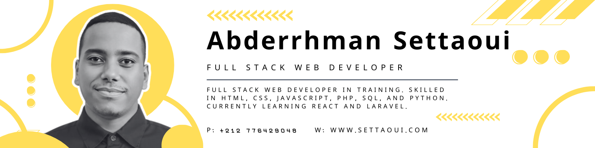

# Hello, I'm Abderrhman Settaoui

  

  
  
  

---

## About Me

  

  

I’m a full-stack web developer.
I create modern, efficient, and well-structured web applications using best practices.

---

## Technologies & Tools

### Frontend

  
  
  
  
  

### Backend

  
  
  
  
  

### Tools & Platforms

  
  
  

---

## GitHub Stats

  
  

  
  

---

## Featured Projects

  

  

---

## Education

| Year                         | Degree                  | Institution               |
|------------------------------|-------------------------|---------------------------|
|  | Digital Development       | OFPPT                     |
|  | Electrical Tech Baccalauréat | Lycée Hassan 2 Marrakech |

---

## Languages

  
  
  

---

## Open to Collaborations & New Projects

Whether you want to:

-  
    
  Build a web application  

-  
    
  Create a modern portfolio site  

-  
    
  Convert UI/UX designs to clean, efficient code  

-  
    
  Contribute to open-source projects  

Feel free to reach out — I’m always excited to collaborate and learn.

---

## Contact Me

  
  
  
  
  
  
  
  
  

---

  

